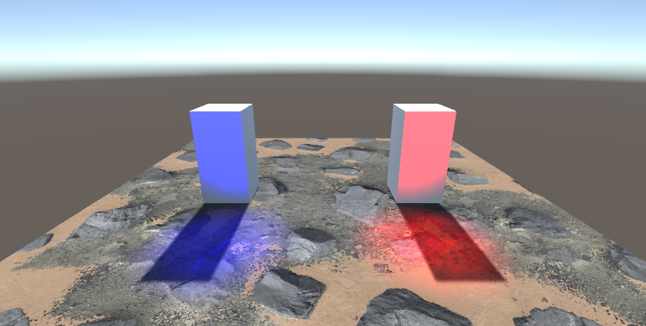
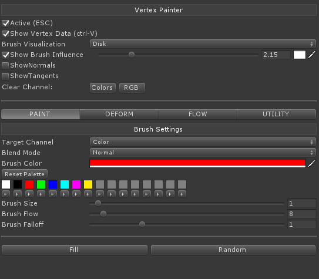
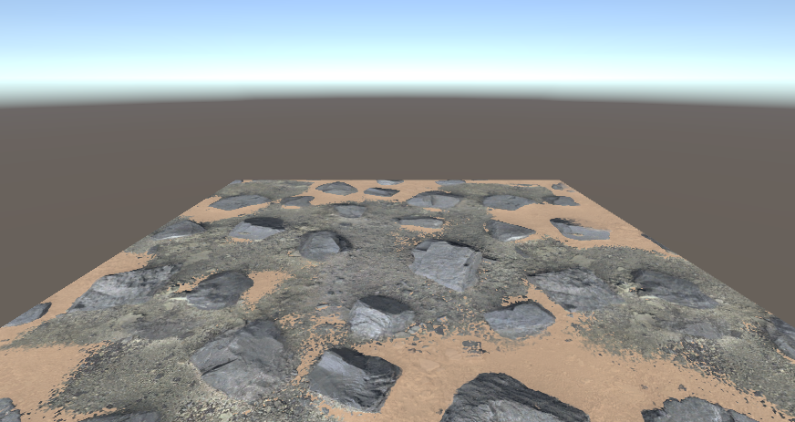

# Unity_VertexPainter

This tool edits and deforms the vertex color of mesh on Unity.

## Version 2019.2.20f1

- Support ShaderModel 3.0
- Support FragmentShader
- Support ForwardAdd

- Support LightMap

- Not Support DefferdRendering 

## How To Use
- Hierarchy Spawned Mesh

- WindowMenu (Custom/Vertex Painter)

- Select Mesh
- Select Shader (VertexPainter/SplatBlendSpecular 1~3)
- As You Like VertexPaint or Deform

- Finish

